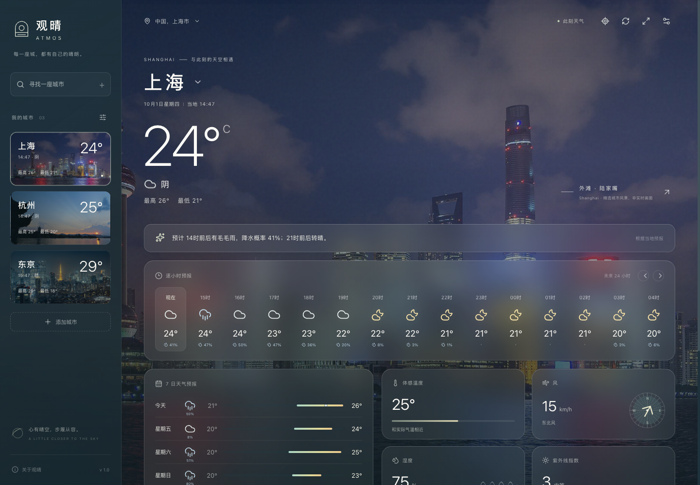

# 观晴 · Atmos

一扇窗，一座城。真实天气悬浮在城市风景之上，随当地时间自然变换。

这是 Atmos 的 **GitHub 发行仓库**，提供已构建的 Codex 插件。插件在使用者自己的电脑上运行，无需自建服务器。个人、非商业天气查询无需 API Key。



## 安装

准备 Git、Node.js 22 或以上，以及支持 `plugin` 命令的 Codex CLI。`node`、`git`、`codex` 应可从终端和 Codex 的运行环境中访问。本项目已验证 macOS 桌面宿主与 Codex CLI 0.159.2；其他系统尚未完成实机验收。

```bash
codex plugin marketplace add Alexixyc/atmos-marketplace --ref main
codex plugin add atmos-weather@atmos-local
```

安装后刷新或重新打开 Codex，在新聊天中选择「观晴 · Atmos」，输入“打开天气”。无需执行 `npm install`、`npm run dev` 或 `npm start`。插件会自动复用或启动本机 Web 服务。

`atmos-local` 是市场清单中的固定标识；`atmos-weather` 是插件标识。这是 GitHub 自建插件市场，尚未上架官方公开目录。普通用户无需访问私有开发仓库。

## 使用案例

| 你可以这样说 | 插件的作用 |
| --- | --- |
| 打开天气 | 打开界面，提供定位与搜索入口 |
| 看看杭州天气，打开天气界面 | 查询杭州并展示西湖风景 |
| 切换到上海 | 协调切换城市、天气、当地时间和背景 |
| 纽约未来 24 小时会下雨吗？ | 查询真实预报并给出中文摘要 |
| 巴黎未来 7 天天气怎么样？ | 返回逐日预报 |
| 东京的背景照片来自哪里？ | 提供地标、作者、来源与使用许可 |

首次打开可选择“使用当前位置”或手动搜索；只有点击定位后才申请权限。拒绝定位或宿主不支持时仍可搜索。设置支持摄氏/华氏、关闭动态壁纸；收藏和设置保存在当前浏览器或宿主中。前台约每 10 分钟刷新，也可手动刷新。

精选背景包含北京、上海、杭州、成都、深圳、香港、东京、巴黎、伦敦、纽约。其他城市正常查询天气，缺少对应景观时明确显示临时背景。背景是精选照片与动态效果，并非实时摄像头画面。

## 更新

```bash
codex plugin marketplace upgrade atmos-local
codex plugin add atmos-weather@atmos-local
```

随后刷新插件并打开新聊天。市场升级拉取 `main`，再次安装刷新本机插件副本；运行中的聊天不会自动切换到新进程。版本与对应源码提交号见 [release.json](release.json)，历史版本可在仓库 Tags 中查看。

## 常见问题

- **找不到 codex 或 plugin 命令**：先安装/更新支持插件管理的 Codex CLI，并用 `codex plugin --help` 检查。macOS 用户若终端 CLI 过旧，可使用桌面应用自带的 CLI；已验证的位置是 `/Applications/ChatGPT.app/Contents/Resources/codex-cli/bin/codex`。
- **启动时提示找不到 node**：确认已安装 Node.js 22+，并让桌面应用的运行环境也能找到 `node`；重新启动 Codex 后重试。
- **已装过开发版**：`codex plugin marketplace list` 可查看来源。若 `atmos-local` 指向本地开发目录，先执行 `codex plugin marketplace remove atmos-local`，再执行本文的两条安装命令。
- **工具安装了但界面没出现**：在新聊天明确选择插件并说“打开天气界面”。宿主支持 MCP Apps 时使用内嵌入口；否则 Codex 可打开工具返回的本机 Web 链接。原生 MCP Apps 内嵌画面尚未完成实机视觉验收，Codex 内置浏览器的 Web 入口已验证。
- **页面打不开或端口被占用**：重新调用“打开天气”；插件默认使用 `127.0.0.1:4317`。即使图形入口失败，仍可使用天气查询工具获得文字结果。
- **网络错误或天气过期**：检查天气数据源的网络连通性，使用刷新/重试。缓存结果会标明数据时间，不会用模拟数据冒充实时天气。

## 数据与许可

天气来自 [Open-Meteo](https://open-meteo.com/)，当前值属于气象模型估计。天气数据时间、刷新时间和缓存状态分别显示。定位坐标仅在使用定位功能时交给天气和反向地理编码服务，收藏不经过开发者云端账号同步。

- [十城照片署名、来源和许可](atmos-weather/docs/landscapes.md)
- [第三方软件许可声明](THIRD_PARTY_NOTICES.md)
- [宿主集成与验证范围](atmos-weather/docs/integration.md)
- [运行截图与验收记录](atmos-weather/docs/verification.md)

## 反馈与维护

问题请提交到本仓库的 [Issues](https://github.com/Alexixyc/atmos-marketplace/issues)，附上系统、Codex/Node 版本、复现步骤和不包含敏感内容的错误信息。

开发仓库为 [Alexixyc/weather-Atmos-codex-plugin](https://github.com/Alexixyc/weather-Atmos-codex-plugin)（私有，需授权）。维护者在开发仓库迭代，再将构建结果同步到此仓库；请勿直接修改这里的构建文件。分发流程依据 [OpenAI 官方插件打包说明](https://developers.openai.com/plugins/build/plugins)。
