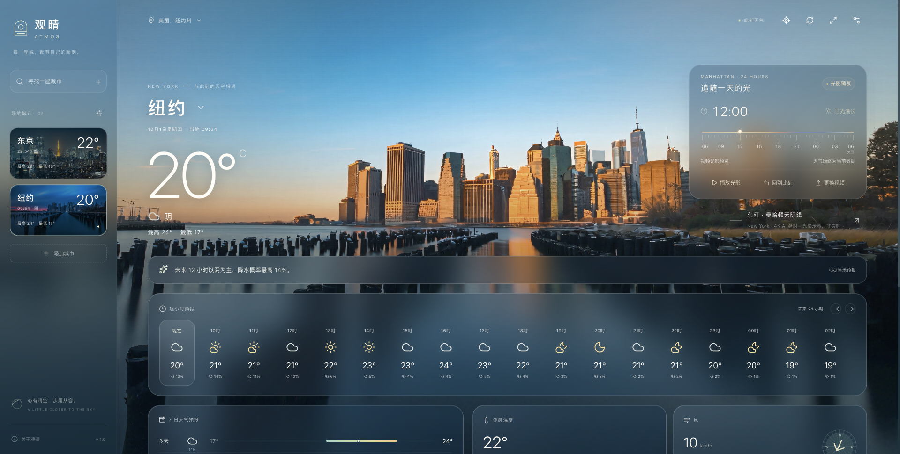
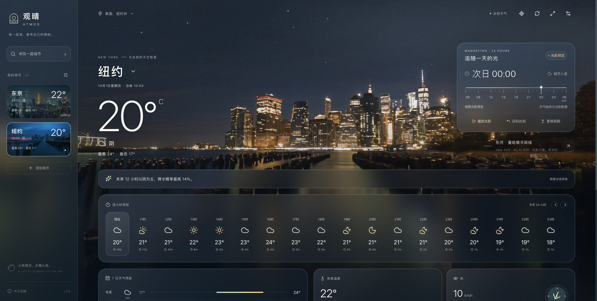
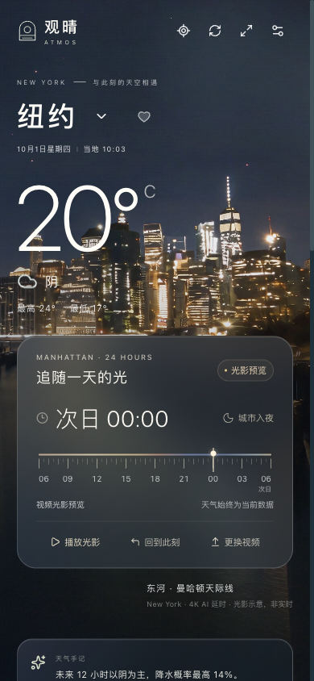
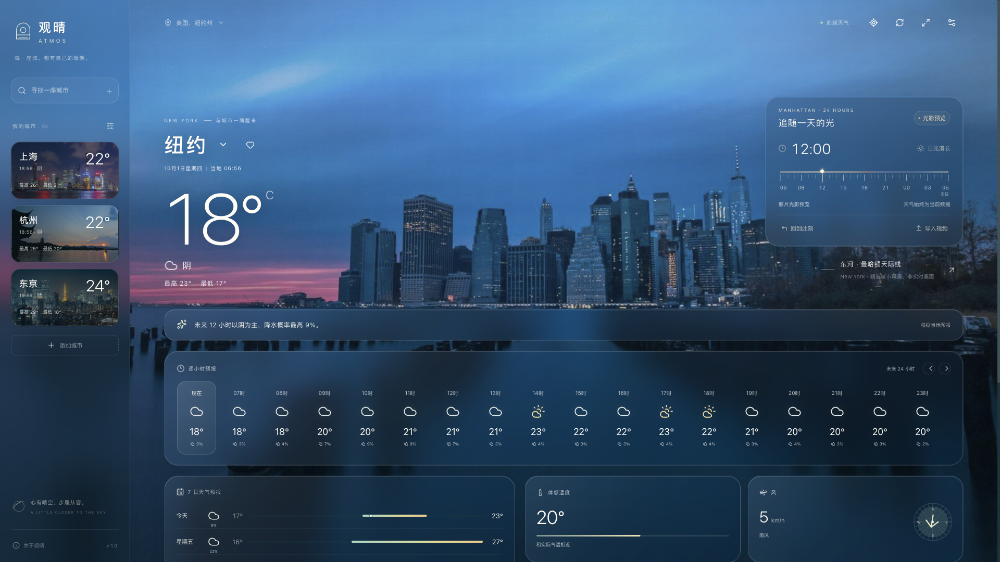
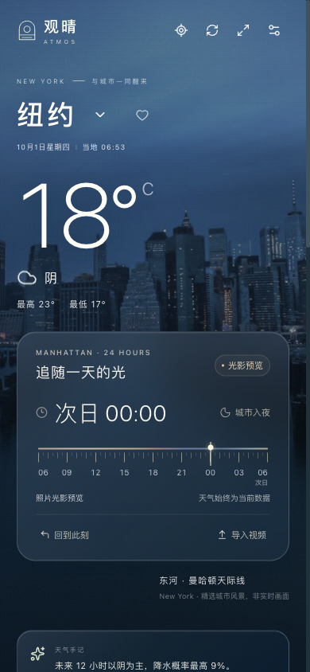
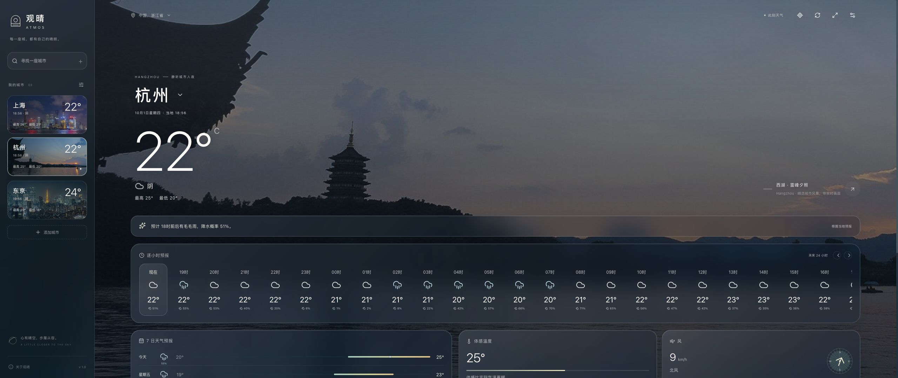

# 城市天气特效与曼哈顿光影预览

验收日期：2026-10-01。环境：macOS，本机 `npm run dev`，Ego Lite 0.5.0.32；实际页面为 `http://127.0.0.1:4317/?city=newyork`。

## 已完成

- 七类天气表现：晴空的缓慢光线、多云的双层云影、阴天的漫射云幕、沿景观地平线移动的雾、分层雨丝与少量玻璃水滴、带近远景虚化的雪、雨幕与克制的远处雷雨微光。
- 真实 WMO 当前天气码决定效果；当前云量、降水量及风速参与强度。雨雪与阴天同时调整景观亮度、饱和度。缺失天气不猜测雨雪。
- 十城使用独立照片和手机 / 桌面 / 超宽屏焦点，按原图尺寸等比覆盖并映射地平线；杭州、成都、纽约有额外等比缩放。原始照片未改动，授权信息保留。
- 天气卡片、城市侧栏与弹窗采用更轻的玻璃层、柔和边缘高光和一致圆角；大屏内容宽度随视口展开。
- 曼哈顿时间尺覆盖 06:00 至次日 06:00，支持悬停、触控、键盘 15 分钟步进及 Home / End；返回此刻恢复纽约当前当地时间。风景预览不修改实际天气、预报与当地时钟。
- 纽约已默认接入用户提供的 4K AI 延时影片，打开时按当地时间定位；支持「播放光影」和暂停。照片保留为失败回退，回退时明确标注「照片光影预览」。影片首尾不连续，片尾暂停后可重新播放。

## 实际检查结果

| 检查 | 结果与范围 |
| --- | --- |
| 构建与测试 | `npm test`：7 个文件、99 项通过；`npm run build` 成功 |
| MCP 回归 | `npm run test:mcp` 通过：5 个工具发现、中文城市搜索、真实天气、景观、反向解析、Web 打开、单文件 UI 资源与显示元数据；报告见 `mcp-verification.json` |
| 十城地标 | 逐一通过界面选城，确认天气、标题、当前照片路径与城市一致；2560 × 1080 下每张照片完整覆盖画面，未发生横向溢出；人工查看全部最终构图 |
| 响应式 | 320、390、760、820、960、1440、1920、2560、3840 像素宽度均无页面横向溢出；320 窄侧栏、390 手机和 960 布局实际截图检查 |
| 天气动效 | 测试页面临时替换响应为 WMO 0、2、3、45、63、75、95，验证七类效果与动画持续变化；雨、雪、雾实际截图检查。测试结束恢复真实天气，产品没有模拟天气开关 |
| 动画暂停 | 设置关闭动画后，雨粒子画布保持不变，镜头动画为 none；系统减少动态效果同样冻结粒子；模拟页面隐藏后冻结，恢复前台继续工作 |
| 性能边界 | 雨雪最多 176 粒子，最多 30 FPS，DPR 最多 1.5，画布总像素限制约 400 万；监听与 RAF 在卸载时清理 |
| 光影交互 | 鼠标悬停至 21:00、方向键 15 分钟步进、Home / End、次日 06:00 端点均正确；手机实际触控拖至午夜，显示次日 00:00 |
| 视频解码 / 取帧 | 用 4 秒 H.264 测试图案片验证导入：06:00 → 0 秒、午夜 → 3 秒、次日 06:00 → 4 秒；快速悬停以最终目标为准，视频保持暂停。此测试片不是风景成片，未加入产品资源 |
| 视频生命周期 | 关闭 / 减少动画时仍可手动取静态帧；损坏 MP4 解码失败时显示提示并回到照片；纽约 → 东京 → 纽约可重新等待首帧后显示视频 |
| 快速切城 | 对上海和杭州请求人为加入不同延迟，连续选择上海、杭州、东京；最终天气标题、背景和图片均为东京 |
| 图片失败 | 临时让东京图片返回无效资源，页面保留温度与 24 小时预报并显示备用底色说明；恢复图片并刷新后正常 |

MCP 资源与工具由 SDK 客户端验证；本次没有声称已在 Codex 原生 MCP Apps 视图中完成视频解码验收。视觉检查针对同一套前端的本地 Web 页面。相关改动及后续播放修复纳入 1.1.0 发行，既有 1.0.0 标签保持不变。

## 4K 影片接入复验

本节保留同日首次接入 30 fps 成片时的验收数值。随后已更新为保留原片全部画面的恒定 24 fps 版本；最新交互和性能结果见 [播放流畅度复验](video-playback-verification.md)，当前来源与规格见 [影片说明](manhattan-video.md)。

| 检查 | 实际结果 |
| --- | --- |
| 默认资源 | 刷新后无需文件导入即可加载；浏览器解码尺寸为 3840 × 2160，时长 24.066016 秒，H.264、恒定 30 fps、无音轨 |
| 时间尺 | 正午 12:00 定位 6.016504 秒；次日 00:00 定位 18.049512 秒；06:00 起点与次日 06:00 终点分别为首尾帧 |
| 连续播放 | 从选时继续，时间尺随进度更新；鼠标悬停即暂停并取目标帧；播放和暂停按钮正常 |
| 片尾 | 暂停于 24.066016 秒，时间尺显示次日 06:00；`loop=false`，再次点击从首帧重播 |
| 城市切换 | 纽约 → 东京时视频移除，东京 → 纽约时内置影片重新就绪，城市和资源一致 |
| 动态设置 | 系统减少动态效果、应用关闭动态、模拟页面隐藏均暂停视频；减少动态模式下键盘仍可选静态帧 |
| 失败恢复 | 临时指向不存在的 MP4，回到照片并保留温度与预报；设置中的「重试影片」恢复原视频 |
| 构图 | 1920 桌面、2560 超宽屏以 cover 铺满；390 手机、320 窄屏无横向溢出。竖屏视频焦点调整为 70% 50%，保留世贸中心一号楼；三个按钮高度均为 44 px |
| 插件 | MCP HTML 不含 base64 视频，使用精确 loopback 媒体 CSP；206 Range 取帧和直接读取 resource 启动媒体服务通过，端口占用可回退照片 |
| 打包 | 源文件、dist 与 release 插件包的视频大小和 SHA-256 一致 |

此处记录首次接入时的本地构建；1.1.0 发行使用后续修复的 24 fps 影片。GitHub 发行不会自动替换已安装的宿主缓存，用户需执行更新命令并重新打开聊天。原生 MCP Apps 视频解码不在此次实际验收范围内。

## 使用与后续素材

1. 打开纽约，在右侧「追随一天的光」时间尺上移动鼠标；手机上拖动时间尺。
2. 点击「播放光影」从选时继续观看，或「回到此刻」恢复当地时间的静态画面。
3. 「更换视频」可选择小于 200 MB 的文件。推荐 H.264 MP4；WebM / MOV 的可用性取决于浏览器解码器。
4. 临时换片仅在当前页面使用，不上传、不写入仓库；刷新或设置中的「恢复默认」恢复内置 4K 影片。
5. 后续生成其他影片时，可参考 [Seedance 提示词](manhattan-seedance-prompt.md)，并检查建筑轮廓、光照映射、手机裁切和首尾衔接。

## 截图

默认 4K 影片：桌面日光、桌面夜色和手机夜色。天气与当地时钟仍为打开时的真实数据：

以下保留首轮照片光影方案的检查截图：

桌面正午光影预览（实际天气仍为打开时的当前天气）：

手机午夜照片光影预览：

杭州超宽屏：

