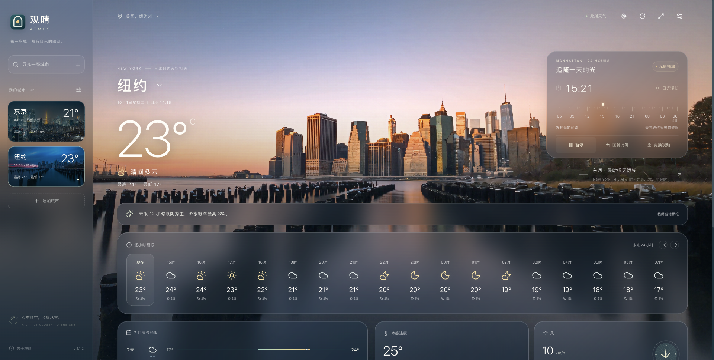
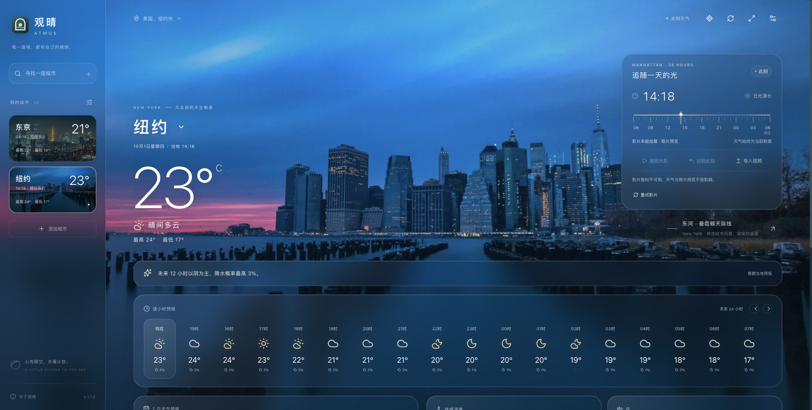

# 纽约影片播放流畅度复验

日期：2026-10-01。针对连续播放和时间尺滑动的卡顿反馈，检查原始影片、播放器定位逻辑与实际浏览器播放。

## 修改

- 逐帧比较表明：原片有 577 个不同画面，平均约 24 fps；旧网页 30 fps 版有 722 帧，其中 145 次重复同一源帧（20.1%）。当前版本直接从原片保留全部 577 帧，以恒定 24 fps 均匀排布，分辨率仍为 3840 × 2160，不做 AI 插帧。
- 鼠标和触控时间尺从 15 分钟量化改为连续选时，过滤小于 0.35 CSS px 的抖动。键盘继续支持 15 分钟步进，Page 按键调整 3 小时，Home / End 定位首尾。
- 播放游标采用 220 ms 平滑过渡，手动选时立即响应；片尾重播的大跨度跳转不扫过整条时间尺。
- 视频淡入完成后隐藏底图并暂停其动画，停止逐进度更新被遮住照片的色彩滤镜。
- 浏览器完成 seek 后，认可已经请求的目标位置，兼容时间落在实际帧边界的行为，避免反复定位相同目标。开始连续播放后清除这个记录，保证以后能重新定位到旧位置。

## 实测

macOS / Ego Lite 0.5.0.32，1920 × 971 CSS px、DPR 2，真实本地 Web 页面，天气特效与玻璃卡片保留。

| 场景 | 结果 |
| --- | --- |
| 旧版初次播放 12 秒 | 362 解码帧、6 丢帧、1 次 waiting；连续播放期间没有额外 seek |
| 新版完整缓冲后播放 12 秒 | 288 解码帧、0 丢帧、0 waiting / stalled、0 额外 seek |
| 连续 pointer | 非整刻位置得到 12.047996 小时，未被吸附到 12:00 或 12:15；方向键后为 12.297996 小时 |
| 模拟帧边界量化 | 请求 10.842794 秒、播放器落在 10.833333 秒；只写入一次 currentTime，没有重复 seek，随后可持续播放 |
| 片尾 | 停在 24.041667 秒，显示次日 06:00，不循环 |
| 视频故障 | 模拟缺失 MP4 后底图立即恢复可见，天气预报保留 |
| 减少动态效果 | 连续播放暂停，按钮禁用；恢复设置后可正常使用 |
| 当前 Codex In-app Browser | 刷新用户现有预览后，确认 3840 × 2160、24.041667 秒，点击后 paused=false、界面显示「光影播放」 |
| 检查与构建 | 102 项单元测试通过，TypeScript 与生产构建成功 |

上述暖缓存测量用于确认没有解码丢帧或重复定位，并非跨设备性能保证，也不能把新旧不同帧率的解码数量直接当作提升百分比。画面仍是原片的 24 个不同采样/秒；没有声称生成 60 fps 中间画面。原生应用内浏览器本轮验证了实际加载与播放状态，精确计数来自 Ego Lite。

另试验较低的玻璃模糊半径，没有测得稳定的帧率收益，因此没有将该样式改动纳入代码。保留原来的玻璃质感。

素材规格与 SHA-256 见 [影片说明](manhattan-video.md)。上述检查在本地开发构建完成；相关改动纳入 2026-10-02 的 1.1.0 发行，见[版本记录](changelog.md)。

## 城市入口与视频缓存修复

随后收到「视频不见了」反馈。直接检查用户当前 Codex In-app Browser 页面，地址为 `?city=newyork`，实际选中城市为上海，页面中没有 video 元素；切回纽约后，4K 视频可正常加载并显示。确认的问题是切换城市没有更新地址，纽约入口与当前内容发生错位；本次没有观察到解码错误。

- 独立 Web 界面在所选城市提交后同步地址参数，刷新和复制链接会恢复同一城市。精选城市保存稳定 ID，其他城市保留坐标、时区与地区信息；MCP 内嵌视图不改宿主地址。
- 影片 URL 加入内容版本 `?v=f29fabd4e327`，使新旧编码使用不同的缓存键，防止更新素材后沿用旧媒体缓存。
- 在用户现有预览中实测：纽约 → 上海时地址变为 `?city=shanghai`，刷新后仍为上海；再切回纽约时地址同步，版本化视频解码尺寸为 3840 × 2160、时长 24.041667 秒，点击播放后 `paused=false`，实际截图确认风景显示。
- 106 项测试和生产构建通过；MCP 资源包含版本化 URL，对该 URL 的 Range 请求返回 206。

## 1.1.0 发行复核 · 2026-10-02

- 完整测试为 9 个文件、114 项通过；TypeScript、前端生产构建和服务端打包通过。
- 新增 8 项本机服务回归：匹配版本复用、旧服务 / 旧插件 / 旧影片 / 其他应用占用端口、并发启动竞争，以及 MCP opener 与 UI resource 并行调用时的实际 origin、CSP 和 206 Range。一切仅监听 loopback，不终止已存在的服务。
- 真实天气 MCP 冒烟验证通过，服务版本与插件清单均为 1.1.0，返回杭州当前天气、24 小时和 7 天预报；首次网络连接超时后完整重试成功。详细结果见 `mcp-verification.json`。
- Codex CLI 对本地发行包执行只读 `plugin/list` 与 `plugin/read`，确认市场 `atmos-local`、插件 `atmos-weather`、MCP `atmos` 与天气 Skill；没有更改当前用户的安装来源或宿主缓存。
- GitHub 发行沿用已验证的 Web 界面；上述协议和包验证不替代原生 MCP Apps 视频视图的实际视觉验收。

## 1.1.2 内嵌媒体修复 · 2026-10-02

安装后的纽约页面显示照片且播放按钮禁用，并非视频漏打包：已安装 1.1.1 缓存里的影片为 62,676,514 字节，SHA-256 与项目文件一致。以缓存中的 MCP bundle 实际启动后，媒体 URL、CSP metadata 和本机 Range 206 均正确。

进一步只读检查当前官方宿主 26.928.21956 的静态实现，并隔离执行其 URL 校验函数，确认原生 MCP Apps 会过滤 HTTP loopback resource origin、阻止 `http://127.0.0.1` 请求。独立 Web 浏览器可正常解码同一影片。1.1.2 因此改用固定发行标签上的 HTTPS 视频供内嵌视图读取，独立网页继续读取包内本地影片；没有修改或关闭宿主安全限制。

- 全部 119 项测试、TypeScript 和生产构建通过。
- 实际 MCP 工具查询真实天气通过；UI URI 为 `ui://atmos/weather-1.1.2.html`，CSP 仅允许 HTTPS 媒体来源；本地与远程 Range 206 的长度、总文件大小、首段字节一致。
- Ego Lite 0.5.0.32 实际加载 HTTPS 影片，readyState=3、时长 24.041667 秒，无媒体错误；这项验证是浏览器解码验证，不是原生宿主播放验收。
- 独立网页模拟 MP4 被阻止：照片和天气保留，显示「影片未能加载」与「重试影片」。解除阻止后点击重试，readyState=4、播放按钮启用；点击播放后 currentTime 连续增长、paused=false，暂停可用。
- 初次加载新增累计前台 20 秒超时保护，后台停表；计时器的暂停、恢复、就绪后取消和卸载清理有独立回归测试。
- 在内嵌面板提供「本地播放链接」，显示工具实际返回的本机端口并带上当前城市，可复制到浏览器打开。当前原生 openLink 通用处理链只接受 HTTPS / Codex 协议，因此本机 HTTP 备用链接不依赖该接口。

原生 MCP Apps 面板在本次可控标签列表中不可用，不能把上述协议、静态分析和浏览器结果当作原生画面实测。更新后应在新聊天打开插件核对；HTTPS 不可达时可使用独立网页播放包内影片。

